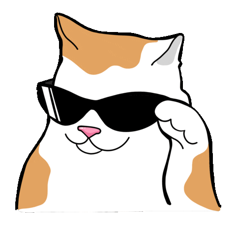

#  Hi, I'm Godwin

<em>Computer Science Graduate</em>
 
<em>Pretty much more ☕ and less 💤 </em>

> 👋 Hi! I do design and software development.

### Tech Stack 💪 

 
 

### Get Connected 🏃

Take your time and let's get in touch. [Click here](https://godoin.github.io/StaticContactPage/)

<!--

  
  
  

 

#
-->

### Stats 👇

#### I love cats so here are some stickers:

   
   
   
   
   
   
   
   
   
   

<!--

   
   
   
   
   
   
   
   
   
   
   
     

-->

<!-- 
Hii
 -->

<!-- ### Languages

          
  
  
  
  
  
  
  
  

 --> 
