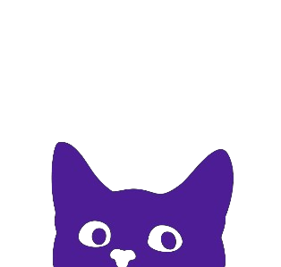

<h2> Hi, I'm Godwin </h1>
<em>4th Year Computer Science student at <a href="su.edu.ph/">Silliman University</a>💢 </em>
 
<em>Pretty much more ☕ and less 💤 </em>

 

>👋 Hello! I do UI/UX design and mainly software development, but I can also do statistics 💯

### Tech Stack 💪 

 
 

#

### Get Connected 🏃

Take your time and let's get in touch. [Click here](https://github.com/OnePewStrike).

  
  
  

 

#

### Github Stats 👇

<!-- 
Hii
 -->

<!-- ### Languages

          
  
  
  
  
  
  
  
  

 --> 
